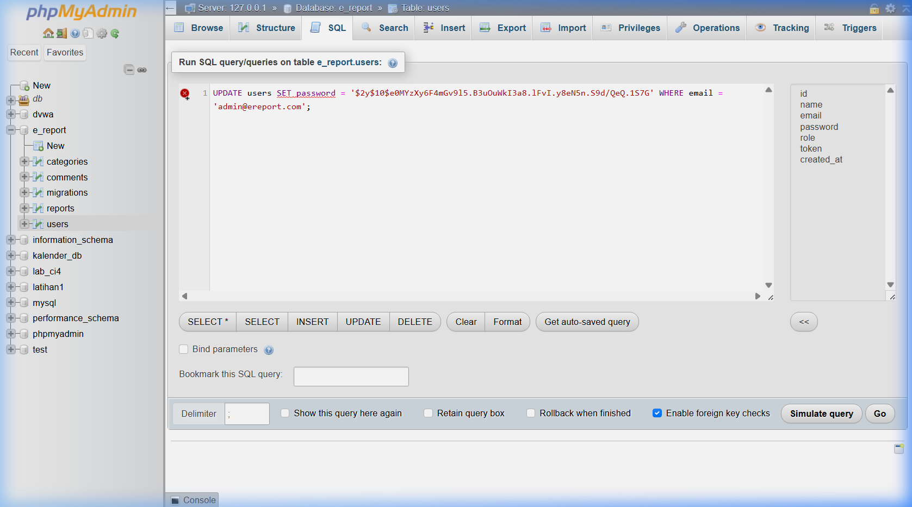

# 📋 Sistem Informasi E-Report (Pengaduan Masyarakat)

**Ujian Akhir Semester — Pemrograman Web 2**

| Informasi | Detail |
|---|---|
| **Nama** | Muhammad Arkhamullah |
| **NIM** | 312410545 |
| **Mata Kuliah** | Pemrograman Web 2 |
| **Tema** | Sistem Pelaporan Pengaduan Layanan Masyarakat (E-Report) |

---

## 📖 Deskripsi Proyek

E-Report adalah Sistem Informasi Pengaduan Masyarakat berbasis web dengan arsitektur **Decoupled (Terpisah)**. Sistem ini memisahkan secara penuh antara **Backend (REST API Server)** dan **Frontend (Single Page Application)**.

**Fitur Utama:**
- 🏠 **Landing Page Publik** — Menampilkan ringkasan statistik pengaduan dan 5 laporan terbaru
- 🔐 **Otentikasi Admin** — Login dengan Bearer Token Authentication
- 📊 **Dashboard Admin** — KPI Cards dan tabel data laporan terbaru
- 📝 **CRUD Laporan** — Buat, lihat detail, ubah status, dan hapus laporan
- 🏷️ **CRUD Kategori** — Kelola kategori aduan (Infrastruktur, Keamanan, dll)
- 💬 **Tanggapan Resmi** — Admin dapat memberikan komentar resmi pada setiap laporan
- 📸 **Upload Gambar Bukti** — Lampiran foto pada setiap laporan
- 🛡️ **Proteksi API** — Endpoint manipulasi data diproteksi dengan AuthFilter (Bearer Token)

---

## 🛠️ Spesifikasi & Ekosistem Teknologi

| Komponen | Teknologi |
|---|---|
| **Backend Engine** | PHP CodeIgniter 4 (CI4) — RESTful API Server (Resource Controller) |
| **Frontend Engine** | Vue.js 3 + Vue Router 4 (CDN) — Single Page Application |
| **UI Framework** | TailwindCSS via CDN — Utility-first CSS |
| **HTTP Client** | Axios — Request/Response Interceptors + Bearer Token |
| **Database** | MySQL / MariaDB |
| **Keamanan** | Bearer Token Authentication, CORS Filter, Navigation Guards |

---

## 📂 Struktur Direktori Proyek

```
UAS_Web2_312410545_Muhammad_Arkhamullah/
├── backend-api/                    # CodeIgniter 4 REST API
│   ├── app/
│   │   ├── Config/
│   │   │   ├── Routes.php          # Definisi endpoint API
│   │   │   └── Filters.php         # Konfigurasi CORS & Auth Filter
│   │   ├── Controllers/
│   │   │   ├── Api/Auth.php        # Login & Register
│   │   │   ├── Reports.php         # CRUD Laporan (Resource Controller)
│   │   │   ├── Categories.php      # CRUD Kategori (Resource Controller)
│   │   │   ├── Comments.php        # Tanggapan Admin
│   │   │   └── Dashboard.php       # Statistik Dashboard
│   │   ├── Filters/
│   │   │   ├── AuthFilter.php      # Proteksi Bearer Token
│   │   │   └── CorsFilter.php      # CORS Handler
│   │   └── Models/
│   │       ├── UserModel.php
│   │       ├── ReportModel.php
│   │       ├── CategoryModel.php
│   │       └── CommentModel.php
│   └── public/                     # Entry point & uploads
│
├── frontend-spa/                   # Vue 3 SPA
│   ├── index.html                  # Entry point + CDN imports
│   ├── app.js                      # Router, Interceptors, Guards
│   └── components/
│       ├── Home.js                 # Landing Page (Publik)
│       ├── Login.js                # Halaman Login Admin
│       ├── AdminLayout.js          # Layout Sidebar + Header
│       ├── Dashboard.js            # Dashboard Admin
│       ├── Reports.js              # Tabel Semua Laporan
│       ├── ReportDetail.js         # Detail + Komentar
│       ├── CreateReport.js         # Form Buat Laporan
│       └── Categories.js           # Manajemen Kategori
│
└── README.md                       # Dokumentasi (file ini)
```

---

## 🗄️ Struktur Database

### Skema Relasi Tabel

```
┌─────────────┐     ┌──────────────┐     ┌──────────────┐
│   users     │     │  categories  │     │   comments   │
├─────────────┤     ├──────────────┤     ├──────────────┤
│ id (PK)     │     │ id (PK)      │     │ id (PK)      │
│ name        │◄──┐ │ name         │ ┌──►│ report_id(FK)│
│ email       │   │ │ description  │ │   │ admin_id(FK) │──►users
│ password    │   │ │ created_at   │ │   │ body         │
│ role        │   │ └──────────────┘ │   │ created_at   │
│ token       │   │                  │   └──────────────┘
│ created_at  │   │ ┌──────────────┐ │
└─────────────┘   │ │   reports    │ │
                  │ ├──────────────┤ │
                  └─│ user_id (FK) │ │
                    │ category_id  │─┘──►categories
                    │ id (PK)      │
                    │ title        │
                    │ description  │
                    │ image        │
                    │ location     │
                    │ status       │
                    │ created_at   │
                    │ updated_at   │
                    └──────────────┘
```

**Screenshot Relasi Tabel (phpMyAdmin Designer):**


---

## 🔌 Daftar Endpoint API

### Public Endpoints (Tanpa Token)

| Method | Endpoint | Deskripsi |
|---|---|---|
| `POST` | `/api/auth/login` | Login & mendapatkan Bearer Token |
| `POST` | `/api/auth/register` | Registrasi akun baru |
| `GET` | `/api/categories` | Daftar semua kategori |
| `GET` | `/api/reports` | Daftar semua laporan |
| `GET` | `/api/reports/{id}` | Detail laporan + komentar |

### Protected Endpoints (Wajib Bearer Token)

| Method | Endpoint | Deskripsi |
|---|---|---|
| `GET` | `/api/dashboard` | Statistik dashboard |
| `POST` | `/api/categories` | Tambah kategori baru |
| `PUT` | `/api/categories/{id}` | Update kategori |
| `DELETE` | `/api/categories/{id}` | Hapus kategori |
| `POST` | `/api/reports` | Buat laporan baru |
| `PUT` | `/api/reports/{id}` | Update laporan/status |
| `DELETE` | `/api/reports/{id}` | Hapus laporan |
| `POST` | `/api/reports/{id}/comments` | Tambah tanggapan |
| `DELETE` | `/api/comments/{id}` | Hapus tanggapan |

---

## 📸 Tangkapan Layar Aplikasi

### 1. Halaman Beranda (Pengunjung Publik)


### 2. Halaman Login Administrator


### 3. Dashboard Admin


### 4. Tabel Data Laporan (TailwindCSS)


### 5. Form Modal Tambah/Edit Kategori


### 6. Form Input Buat Laporan Baru


### 7. Detail Laporan & Tanggapan Admin


### 8. Uji Coba API Gagal — Error 401 Unauthorized (Postman)

*Endpoint `POST /api/reports` ditembak tanpa Authorization Bearer Token → ditolak 401.*

---

## 🚀 Petunjuk Instalasi & Menjalankan

### A. Persiapan Database

1. Buka **phpMyAdmin** di `http://localhost/phpmyadmin`
2. Buat database baru: `e_report`
3. Import file SQL: `e_report.sql` (jika tersedia), atau jalankan migrasi CI4

### B. Konfigurasi Backend (CodeIgniter 4)

1. Masuk ke folder `backend-api/`
2. Salin file `env` menjadi `.env`:
   ```bash
   cp env .env
   ```
3. Edit `.env` dan sesuaikan konfigurasi database:
   ```env
   database.default.hostname = localhost
   database.default.database = e_report
   database.default.username = root
   database.default.password =
   database.default.DBDriver = MySQLi
   ```
4. Sesuaikan `app.baseURL` dengan path proyek Anda

### C. Konfigurasi Frontend

1. Buka file `frontend-spa/index.html`
2. Sesuaikan `window.APP_CONFIG` jika path instalasi berbeda:
   ```javascript
   window.APP_CONFIG = {
       API_BASE_URL: 'http://localhost/UAS_Web2_312410545_Muhammad_Arkhamullah/backend-api/public/api',
       IMAGE_BASE_URL: 'http://localhost/UAS_Web2_312410545_Muhammad_Arkhamullah/backend-api/public/'
   };
   ```

### D. Menjalankan Aplikasi

1. Pastikan **Apache** dan **MySQL** di XAMPP sudah **Start**
2. Akses frontend melalui browser:
   ```
   http://localhost/UAS_Web2_312410545_Muhammad_Arkhamullah/frontend-spa/index.html
   ```
3. Login admin dengan kredensial yang sudah terdaftar di database

> **Catatan:** Tidak perlu menjalankan `php spark serve` karena backend sudah dilayani oleh Apache XAMPP.

---

## 🔐 Fitur Keamanan

| Fitur | Implementasi |
|---|---|
| **Server-Side: AuthFilter** | `App\Filters\AuthFilter.php` — Memvalidasi Bearer Token pada setiap request POST/PUT/DELETE |
| **Server-Side: CORS Filter** | `App\Filters\CorsFilter.php` — Mengizinkan request lintas origin dari frontend |
| **Client-Side: Navigation Guard** | `router.beforeEach()` dengan `meta: { requiresAuth: true }` — Menghalau akses ilegal |
| **Client-Side: Request Interceptor** | Axios interceptor menyuntikkan token otomatis ke header setiap request |
| **Client-Side: Response Interceptor** | Menangkap error 401, menampilkan alert sesi habis, dan redirect ke login |

---

**Dibuat oleh:** Muhammad Arkhamullah (NIM: 312410545) | Ujian Akhir Semester Pemrograman Web 2
