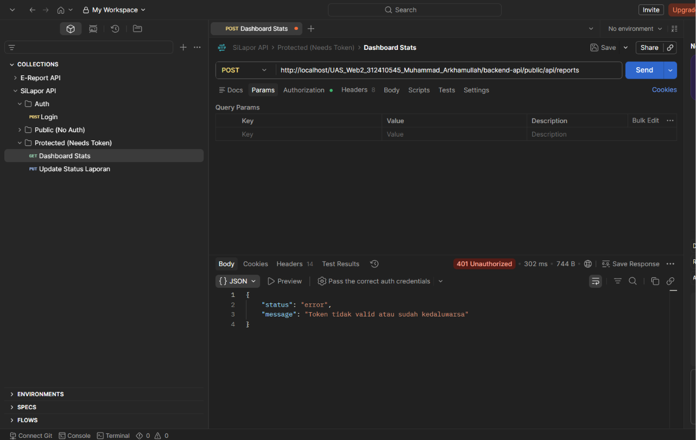
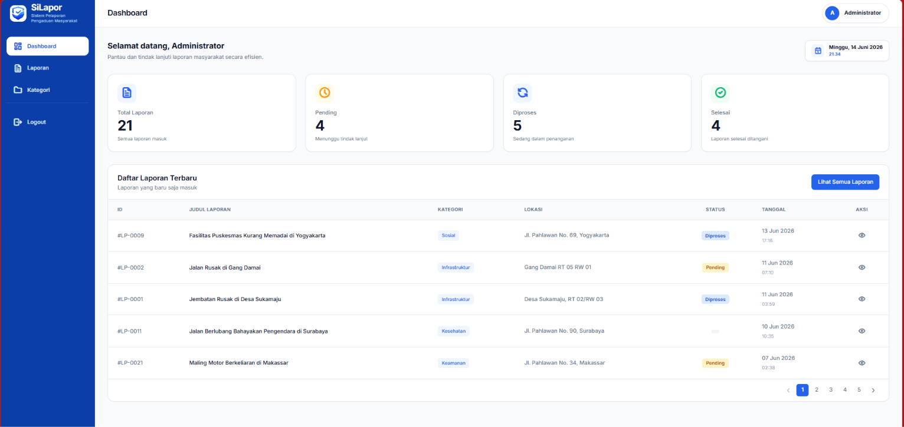
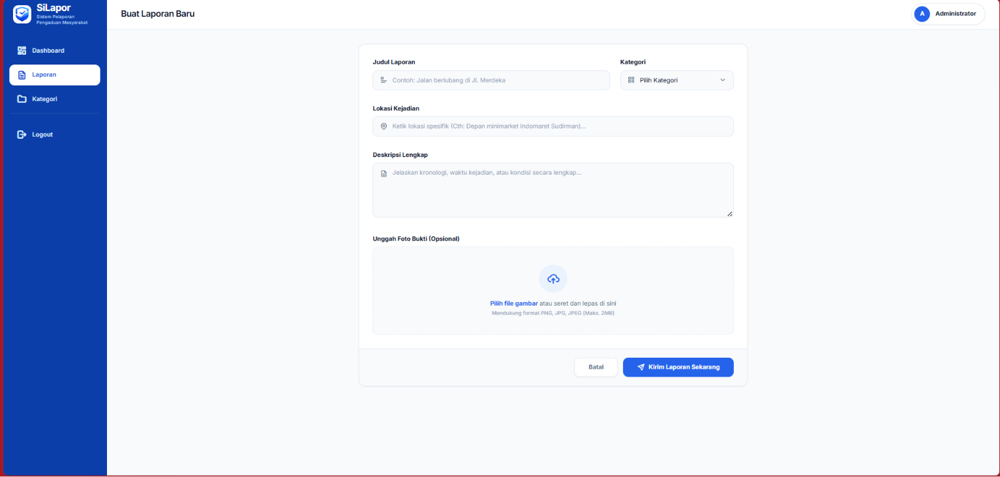
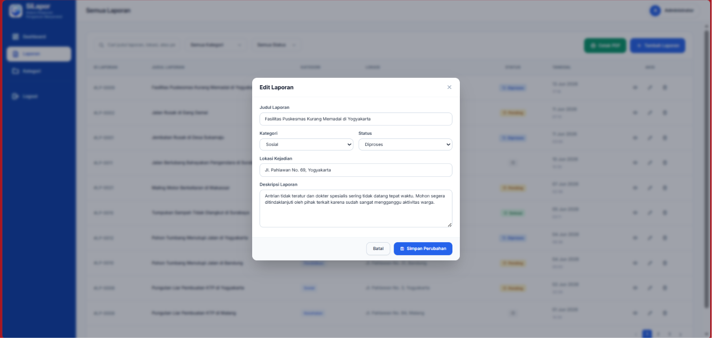

# Sistem Informasi SiLapor
### Pengaduan Layanan Masyarakat Terpadu

| | |
|---|---|
| **Nama** | Muhammad Arkhamullah R.A |
| **NIM** | 312410545 |
| **Kelas** | I241E |
| **Mata Kuliah** | Pemrograman Web 2 |
| **Tugas** | Ujian Akhir Semester (UAS) |

---

## 📋 Daftar Isi

- [Deskripsi Proyek](#deskripsi-proyek)
- [Tautan Pendukung](#tautan-pendukung)
- [Akun Demo](#akun-demo)
- [Struktur Database](#struktur-database)
- [Pengujian Keamanan API](#pengujian-keamanan-api)
- [Implementasi Axios Interceptors](#implementasi-axios-interceptors)
- [Tampilan Aplikasi](#tampilan-aplikasi)
- [Cara Menjalankan Project](#cara-menjalankan-project)

---

## Deskripsi Proyek

### Latar Belakang

SiLapor adalah aplikasi berbasis web yang bertujuan menjadi platform pengaduan masyarakat terpadu. Warga dapat melaporkan berbagai permasalahan layanan publik — seperti infrastruktur rusak, keamanan lingkungan, atau kebersihan — melalui sistem digital yang transparan, dan petugas dapat memantau, memproses, serta menindaklanjuti setiap laporan secara terstruktur.

Aplikasi ini dibangun sebagai proyek Ujian Akhir Semester mata kuliah **Pemrograman Web 2** dengan menerapkan **Decoupled Architecture** (Arsitektur Terpisah) — pendekatan yang memisahkan secara penuh antara backend server (API) dan frontend client (SPA). Pendekatan ini dipilih agar kedua lapisan dapat dikembangkan, diuji, dan di-deploy secara independen.

### Arsitektur Sistem

| Lapisan | Teknologi |
|---------|-----------|
| **Backend API** | CodeIgniter 4 (RESTful Resource Controller) |
| **Frontend SPA** | Vue.js 3 + Vue Router 4 (via CDN) |
| **UI Framework** | TailwindCSS (via CDN, utility-first) |
| **Data Transfer** | Axios (HTTP asynchronous) |
| **Database** | MySQL / MariaDB |
| **Animasi** | AOS (Animate On Scroll), Chart.js |

Sistem menggunakan pola komunikasi **Client → Server via REST API**:
- Frontend tidak pernah mengakses database langsung
- Semua operasi data (CRUD) melewati endpoint API backend
- Data dikirim dalam format JSON melalui HTTP method: GET, POST, PUT, DELETE
- Token autentikasi dikirim via HTTP Header `Authorization: Bearer <token>` untuk endpoint yang dilindungi

---

### Backend API (CodeIgniter 4)

Backend berperan sebagai REST API server yang menyediakan endpoint-endpoint data. Controller utama:

| Controller | Endpoint | Fungsi |
|------------|----------|--------|
| `Api/Auth` | `POST /api/auth/login` | Verifikasi kredensial, generate token |
| `Api/Auth` | `POST /api/auth/register` | Registrasi akun baru |
| `Reports` | `GET/POST /api/reports` | Ambil daftar / buat laporan baru |
| `Reports` | `GET /api/reports/{id}` | Detail laporan + komentar |
| `Reports` | `PUT /api/reports/{id}` | Update laporan |
| `Reports` | `DELETE /api/reports/{id}` | Hapus laporan |
| `Categories` | `GET/POST /api/kategori` | Ambil daftar / tambah kategori |
| `Categories` | `PUT/DELETE /api/kategori/{id}` | Update / hapus kategori |
| `Comments` | `GET/POST /api/komentar` | Ambil / tambah komentar laporan |
| `Dashboard` | `GET /api/dashboard` | Statistik ringkasan dashboard |

**Resource Controller CI4:** Controller `Reports` dan `Categories` menggunakan `CodeIgniter\RESTful\ResourceController`. Ini menyediakan method standar REST (`index()`, `show()`, `create()`, `update()`, `delete()`) yang secara otomatis menangani kode HTTP response dan format JSON.

**Contoh alur request laporan:**
```
[Browser] → GET /api/reports?status=pending
           → Reports::index()
           → Query join 3 tabel (laporan + kategori + pengguna)
           → Filter by status
           → Return JSON { status: "success", data: [...], total: N }
```

#### Keamanan Backend (AuthFilter)

Semua endpoint manipulasi data (POST, PUT, DELETE) dilindungi oleh filter `AuthFilter` yang terdaftar di `Config\Filters.php` sebagai alias `'auth'`.

**Cara kerja AuthFilter (`app/Filters/AuthFilter.php`):**
1. Ekstrak header `Authorization` dari request
2. Parse token dari format `Bearer <token>` menggunakan regex
3. Cari token di tabel `pengguna` via `UserModel`
4. Jika token tidak ditemukan atau header kosong → return **401 Unauthorized** dengan JSON error
5. Jika token valid → request dilanjutkan ke controller

**Filter routing** diatur melalui `app/Config/Routes.php` (biasanya):
```php
$routes->group('api', ['filter' => 'cors'], function($routes) {
    $routes->post('reports', 'Reports::create', ['filter' => 'auth']);
    $routes->put('reports/(:num)', 'Reports::update/$1', ['filter' => 'auth']);
    $routes->delete('reports/(:num)', 'Reports::delete/$1', ['filter' => 'auth']);
});
```
Route yang TIDAK dilindungi (dapat diakses publik): `GET /api/reports`, `GET /api/kategori`, `POST /api/auth/login`.

#### CORS Handling

Filter `CorsFilter` dipasang sebagai **global filter before** di `Config\Filters.php`:
```php
public array $globals = [
    'before' => ['cors'],
    'after'  => []
];
```
Ini memungkinkan frontend yang berjalan di domain berbeda (Vercel) atau localhost tetap bisa mengirim request ke backend API tanpa diblokir oleh kebijakan **CORS (Cross-Origin Resource Sharing)** browser. Filter menyisipkan header:
```
Access-Control-Allow-Origin: *
Access-Control-Allow-Headers: Content-Type, Authorization
Access-Control-Allow-Methods: GET, POST, PUT, DELETE, OPTIONS
```

---

### Frontend SPA (Vue.js 3 + TailwindCSS)

Frontend adalah Single Page Application (SPA) murni — tidak ada reload halaman saat navigasi. Seluruh komponen dimuat dari file `.js` modular, dirender oleh Vue 3, dan dirutekan oleh Vue Router 4.

#### Struktur Komponen

| File | Rute | Fungsi |
|------|------|--------|
| `Home.js` | `/` | Landing page publik (tanpa login) |
| `Login.js` | `/login` | Form autentikasi admin |
| `Dashboard.js` | `/dashboard` | Statistik + tabel laporan terbaru, aneka kartu KPI, jam real-time |
| `Reports.js` | `/reports` | Tabel manajemen laporan penuh (CRUD + pagination) |
| `ReportDetail.js` | `/reports/:id` | Detail laporan + komentar |
| `CreateReport.js` | `/create` | Form tambah laporan (modal) |
| `Categories.js` | `/categories` | CRUD kategori laporan |
| `AdminLayout.js` | — | Layout wrapper (sidebar, header) untuk halaman admin |

#### Routing & Navigation Guards (`app.js`)

Vue Router dikonfigurasi dengan `createWebHistory()` untuk URL yang bersih (tanpa `#`). Setiap rute admin memiliki properti `meta: { requiresAuth: true }`:

```javascript
const routes = [
    { path: '/', component: Home },                                      // publik
    { path: '/login', component: Login, meta: { guestOnly: true } },     // hanya tamu
    { path: '/dashboard', component: Dashboard, meta: { requiresAuth: true } },  // admin
    { path: '/reports', component: Reports, meta: { requiresAuth: true } },
    // ...
];
```

**Navigation Guard — `router.beforeEach()`:**
```javascript
router.beforeEach((to, from, next) => {
    const isLoggedIn = localStorage.getItem('isLoggedIn') === 'true';

    if (to.meta.requiresAuth && !isLoggedIn) {
        next('/login');           // redirect ke login
    } else if (to.meta.guestOnly && isLoggedIn) {
        next('/dashboard');       // user login tidak boleh lihat login page
    } else {
        next();                   // lanjut
    }
});
```
Jika user ilegal coba akses `/dashboard`, otomatis dilempar ke `/login`. Jika user sudah login coba akses `/login`, otomatis diarahkan ke dashboard.

#### Otomatisasi Token (Axios Interceptors)

Dua lapisan interceptor global di `app.js`:

**1. Request Interceptor — Suntik Bearer Token**
```javascript
window.api.interceptors.request.use(config => {
    const token = localStorage.getItem('token');
    if (token) {
        config.headers.Authorization = `Bearer ${token}`;
    }
    return config;
});
```
Setiap request HTTP dari aplikasi secara otomatis menyertakan token yang tersimpan di `localStorage` — tanpa perlu menulis manual di setiap komponen.

**2. Response Interceptor — Tangani 401 Global**
```javascript
window.api.interceptors.response.use(response => {
    return response;
}, error => {
    if (error.response && error.response.status === 401) {
        const loginPath = isLocal
            ? '/UAS_Web2_312410545_Muhammad_Arkhamullah/frontend-spa/login'
            : '/login';
        if (window.location.pathname !== loginPath) {
            alert('Sesi Anda telah habis. Silakan login kembali.');
            localStorage.clear();
            window.location.href = loginPath;
        }
    }
    return Promise.reject(error);
});
```
Jika server mengembalikan **401 Unauthorized** (token kadaluarsa/dihapus), sistem otomatis:
- Menampilkan alert "Sesi Anda telah habis"
- Membersihkan seluruh `localStorage`
- Redirect ke halaman login

#### UX Features

- **Animated Counters:** Angka statistik dashboard (total, pending, diproses, selesai) naik bertahap (animasi counter 800ms) untuk pengalaman visual yang lebih hidup
- **Skeleton Loading:** Tabel menampilkan placeholder animasi selama data dimuat
- **Pagination:** Navigation page numbers dengan ellipsis untuk dataset besar
- **Scroll Animations:** Fade-in sections pada landing page via Intersection Observer
- **Jam Real-time:** Dashboard menampilkan jam digital yang diperbarui setiap detik

---

## Tautan Pendukung

| Link | URL |
|------|------|
| **🎥 Video Presentasi** | `[Isi link YouTube di sini setelah upload]` |
| **🌐 Demo Frontend** | [https://uas-web2-312410545-muhammad-arkhamu.vercel.app/](https://uas-web2-312410545-muhammad-arkhamu.vercel.app/) |
| **⚙️ Demo Backend API** | [https://uasweb2312410545muhammadarkhamullah-production-733d.up.railway.app](https://uasweb2312410545muhammadarkhamullah-production-733d.up.railway.app) |
| **📦 Repository GitHub** | [github.com/MuhammadArkham/UAS_Web2_312410545_Muhammad_Arkhamullah](https://github.com/MuhammadArkham/UAS_Web2_312410545_Muhammad_Arkhamullah) |

> **Template:** Setelah video diupload, ganti `[Isi link YouTube di sini setelah upload]` dengan URL, contoh: `https://youtu.be/xxxxxxxxxxx`

---

## Akun Demo

| Field | Value |
|-------|-------|
| **Email** | `admin@silapor.com` |
| **Password** | `password` |

---

## Struktur Database

Sistem basis data terdiri dari **empat tabel** yang saling berelasi: `pengguna`, `kategori`, `laporan`, dan `komentar`.


> Entity Relationship Diagram (ERD) — memperlihatkan relasi antar tabel dan foreign key.


> Tampilan dari database designer phpMyAdmin — hubungan foreign key antar seluruh tabel.

---

## Pengujian Keamanan API


> Endpoint yang dilindungi tanpa Bearer Token akan ditolak dengan kode **401 Unauthorized**.


> Pengujian pada endpoint production di Railway — proteksi token konsisten di semua lingkungan.

---

## Implementasi Axios Interceptors

Sistem mengotomatisasi penyisipan token dan penanganan error secara global:

```javascript
// Request Interceptor: Suntik Bearer token otomatis
window.api.interceptors.request.use(config => {
    const token = localStorage.getItem('token');
    if (token) {
        config.headers.Authorization = `Bearer ${token}`;
    }
    return config;
}, error => Promise.reject(error));

// Response Interceptor: Tangani 401 Unauthorized global
window.api.interceptors.response.use(response => {
    return response;
}, error => {
    if (error.response && error.response.status === 401) {
        if (window.location.pathname !== '/UAS_Web2_312410545_Muhammad_Arkhamullah/frontend-spa/login') {
            alert('Sesi Anda telah habis. Silakan login kembali.');
            localStorage.clear();
            window.location.href = '/UAS_Web2_312410545_Muhammad_Arkhamullah/frontend-spa/login';
        }
    }
    return Promise.reject(error);
});
```

**Fungsi:**
1. **Request Interceptor** — Ekstrak token dari `localStorage`, sematkan ke setiap header
2. **Response Interceptor** — Tangkap error 401 global, hapus sesi, redirect ke login

---

## Tampilan Aplikasi

### Halaman Landing Page (Pengunjung)


> Halaman beranda publik — dapat diakses tanpa login. Sesuai ketentuan hak akses soal, pengunjung hanya dapat melihat halaman ini (ringkasan informasi umum).

### Halaman Login


> Form otentikasi administrator dengan desain dua kolom dan TailwindCSS.

### Dashboard Admin


> Panel kontrol utama — ringkasan statistik laporan (total, pending, diproses, selesai) dan tabel data terbaru.

### Form Tambah Data


> Modal form untuk membuat laporan baru — tanpa perpindahan halaman.

### Form Edit Data


> Modal form untuk mengubah data laporan yang sudah ada.

### Tabel Manajemen Data


> Tabel dengan indikator warna status dinamis dan pagination.

---

## Cara Menjalankan Project

### Syarat Sistem
- **XAMPP** (PHP 8.1+ terbaru, MySQL/MariaDB, Apache)
- **Composer** (jika perlu install ulang dependency — sudah include di repo)
- Browser modern (Chrome, Edge, Firefox)

### 1. Clone / Letakkan File

Pastikan folder proyek berada di:
```
C:\xampp\htdocs\UAS_Web2_312410545_Muhammad_Arkhamullah\
```

### 2. Setup Database

1. Buka **XAMPP Control Panel**, nyalakan **Apache** dan **MySQL**
2. Buka `http://localhost/phpmyadmin`
3. Klik **New** → buat database **`silapor`** (pilih collation `utf8_general_ci`)
4. Klik tab **Import** → **Choose File** → cari file **`database_silapor.sql`** di folder proyek
5. Klik **Go** → 4 tabel akan terbuat otomatis (pengguna, kategori, laporan, komentar)

### 3. Jalankan Backend (API)

Buka terminal:

```bash
cd C:\xampp\htdocs\UAS_Web2_312410545_Muhammad_Arkhamullah\backend-api

# Jika file .env belum ada, copy dari env
cp env .env
```

Edit file `.env` — sesuaikan konfigurasi database:

```env
# App
app.baseURL = 'http://localhost/UAS_Web2_312410545_Muhammad_Arkhamullah/backend-api/public/'

# Database
database.default.hostname = localhost
database.default.database = silapor
database.default.username = root
database.default.password =
```

**Verifikasi:** Buka di browser:
```
http://localhost/UAS_Web2_312410545_Muhammad_Arkhamullah/backend-api/public/api/kategori
```
Harusnya muncul JSON daftar kategori (array kosong jika belum ada data).

> **Catatan:** Folder `vendor/` sudah termasuk di repo (tidak perlu `composer install`). Jika error terkait dependency, jalankan `composer install` dari dalam folder `backend-api/`.

### 4. Jalankan Frontend (SPA)

Cukup akses di browser:
```
http://localhost/UAS_Web2_312410545_Muhammad_Arkhamullah/frontend-spa/
```

**Yang terjadi:**
- File `index.html` dimuat
- Vue 3 mengambil alih lewat `#app`
- Router Vue menampilkan komponen `Home.js` (landing page)
- Semua komponen .js lain dimuat via tag `<script>` di index.html
- Axios (`window.api`) otomatis dikonfigurasi dengan `baseURL` menuju `http://localhost/.../backend-api/public/api/`
- Klik "Login" → masuk ke kredensial demo admin

### Struktur Folder

```
UAS_Web2_312410545_Muhammad_Arkhamullah/
├── backend-api/                    # CodeIgniter 4 REST API
│   ├── app/
│   │   ├── Config/
│   │   │   ├── Filters.php         # CORS global + aliases filter
│   │   │   └── Routes.php          # Routing API
│   │   ├── Controllers/
│   │   │   ├── Api/Auth.php        # Login & register
│   │   │   ├── Reports.php         # CRUD laporan (ResourceController)
│   │   │   ├── Categories.php      # CRUD kategori (ResourceController)
│   │   │   ├── Comments.php        # CRUD komentar
│   │   │   └── Dashboard.php       # Statistik ringkasan
│   │   └── Filters/
│   │       ├── AuthFilter.php      # Proteksi Bearer token
│   │       └── CorsFilter.php      # CORS handler
│   ├── Models/                      # ReportModel, CategoryModel, etc.
│   └── public/                      # Entry point CI4 + uploads/
├── frontend-spa/                   # Vue.js 3 SPA
│   ├── index.html                  # Entry point (load semua komponen)
│   ├── app.js                      # Router, axios config, guards
│   └── components/
│       ├── Home.js                 # Landing page publik
│       ├── Login.js                # Form login
│       ├── Dashboard.js            # Dashboard admin + statistik
│       ├── Reports.js              # Tabel manajemen laporan
│       ├── ReportDetail.js         # Detail + komentar laporan
│       ├── CreateReport.js         # Form tambah laporan
│       ├── Categories.js           # Manajemen kategori
│       └── AdminLayout.js          # Layout sidebar + header
├── Screenshots/                    # Dokumentasi gambar
├── database_silapor.sql            # Backup database
└── README.md
```

---

### 📝 Template Link YouTube

```markdown
| **🎥 Video Presentasi** | [https://youtu.be/xxx_isi_link_disini](https://youtu.be/xxx_isi_link_disini) |
```

---

*© 2026 SiLapor — UAS Pemrograman Web 2*
