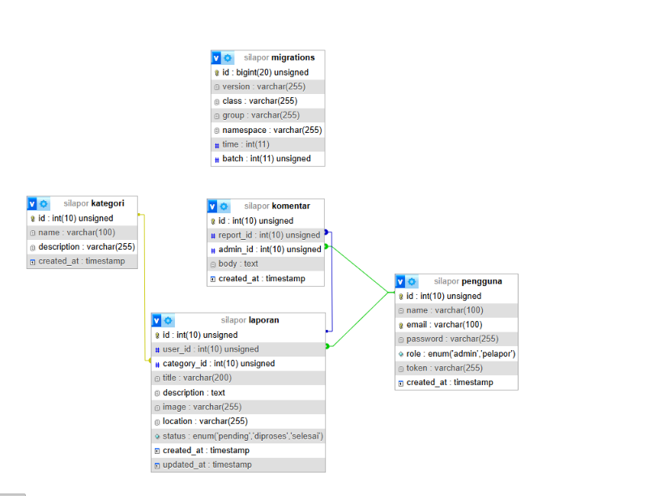

# Sistem Informasi SiLapor
### Pengaduan Layanan Masyarakat Terpadu

| | |
|---|---|
| **Nama** | Muhammad Arkhamullah R.A |
| **NIM** | 312410545 |
| **Kelas** | I241E |
| **Mata Kuliah** | Pemrograman Web 2 |
| **Tugas** | Ujian Akhir Semester (UAS) |

---

## Deskripsi Proyek

SiLapor adalah aplikasi berbasis web untuk pelaporan pengaduan layanan masyarakat. Warga dapat melaporkan permasalahan publik — infrastruktur rusak, keamanan lingkungan, kebersihan — melalui sistem digital yang transparan. Petugas dapat memantau, memproses, dan menindaklanjuti setiap laporan secara terstruktur.

Tema studi kasus: **Sistem Pelaporan Pengaduan Layanan Masyarakat (E-Report)** — mengelola data pelapor, kategori aduan (infrastruktur, keamanan, dll), isi laporan, gambar bukti, dan status penanganan aduan.

Aplikasi dibangun dengan **Decoupled Architecture** — backend API terpisah penuh dari frontend SPA.

| Lapisan | Teknologi |
|---------|-----------|
| **Backend API** | CodeIgniter 4 (RESTful Resource Controller) |
| **Frontend SPA** | Vue.js 3 + Vue Router 4 (CDN) |
| **UI Framework** | TailwindCSS (CDN, utility-first) |
| **Data Transfer** | Axios (HTTP asynchronous) |
| **Database** | MySQL / MariaDB |
| **Deploy Backend** | Railway |
| **Deploy Frontend** | Vercel |

> **Hak akses:** Pengunjung (tanpa login) hanya bisa lihat landing page. Administrator (wajib login) bisa akses dashboard, CRUD data, kelola laporan.

---

## Tautan Pendukung

| Link | URL |
|------|------|
| Video Presentasi | https://youtu.be/9WOmPmGVbdA?si=0Jf-Omq9_EhY0x0G
|  Demo Aplikasi  | [uas-web2-312410545-muhammad-arkhamu.vercel.app](https://uas-web2-312410545-muhammad-arkhamu.vercel.app/) |
|  Demo Backend API (Railway) | [uasweb2312410545muhammadarkhamullah-production-733d.up.railway.app](https://uasweb2312410545muhammadarkhamullah-production-733d.up.railway.app) |


### Akun Demo

| Field | Value |
|-------|-------|
| **Email** | `admin@silapor.com` |
| **Password** | `password` |

---

## Skema Relasi Tabel Database

Sistem menggunakan **4 tabel utama** yang saling terhubung melalui foreign key. Berikut struktur dan relasinya:

### 1. Tabel `pengguna` — Data User

| Kolom | Tipe | Keterangan |
|-------|------|------------|
| `id` | int(10) unsigned PK | Primary key, auto increment |
| `name` | varchar(100) | Nama lengkap user |
| `email` | varchar(100) UNIQUE | Email login (unik) |
| `password` | varchar(255) | Hash bcrypt |
| `role` | enum('admin','pelapor') | Hak akses — admin kelola sistem, pelapor buat laporan |
| `token` | varchar(255) | Token Bearer (diisi saat login) |
| `created_at` | timestamp | Waktu registrasi |

### 2. Tabel `kategori` — Jenis Aduan

| Kolom | Tipe | Keterangan |
|-------|------|------------|
| `id` | int(10) unsigned PK | Primary key |
| `name` | varchar(100) | Nama kategori (contoh: Infrastruktur, Keamanan) |
| `description` | varchar(255) | Deskripsi kategori |
| `created_at` | timestamp | Waktu dibuat |

**Data awal:** Infrastruktur, Keamanan, Lingkungan, Kesehatan, Pendidikan, Sosial.

### 3. Tabel `laporan` — Isi Pengaduan

| Kolom | Tipe | Keterangan |
|-------|------|------------|
| `id` | int(10) unsigned PK | Primary key |
| `user_id` | int(10) unsigned FK | Foreign key ke `pengguna.id` — siapa yang melapor |
| `category_id` | int(10) unsigned FK | Foreign key ke `kategori.id` — jenis aduan |
| `title` | varchar(200) | Judul laporan |
| `description` | text | Deskripsi lengkap |
| `image` | varchar(255) | Path bukti gambar (nullable) |
| `location` | varchar(255) | Lokasi kejadian |
| `status` | enum('pending','diproses','selesai') | Status penanganan |
| `created_at` / `updated_at` | timestamp | Waktu dibuat & diupdate |

### 4. Tabel `komentar` — Tanggapan Admin

| Kolom | Tipe | Keterangan |
|-------|------|------------|
| `id` | int(10) unsigned PK | Primary key |
| `report_id` | int(10) unsigned FK | Foreign key ke `laporan.id` — komentar milik laporan mana |
| `admin_id` | int(10) unsigned FK | Foreign key ke `pengguna.id` — siapa admin yang komen |
| `body` | text | Isi komentar |
| `created_at` | timestamp | Waktu komen |

### Relasi Antar Tabel

```
pengguna (1) ──< (N) laporan (N) >── (1) kategori
                  │
                  │ (1)
                  │
                  ▼
              komentar (N) >── (1) pengguna (admin)
```

Penjelasan:
- **pengguna → laporan:** Satu user bisa membuat banyak laporan (`user_id` FK)
- **kategori → laporan:** Satu kategori bisa dipakai banyak laporan (`category_id` FK)
- **laporan → komentar:** Satu laporan bisa punya banyak komentar (`report_id` FK)
- **pengguna → komentar:** Satu admin bisa menulis banyak komentar (`admin_id` FK)

Semua foreign key menggunakan **ON DELETE CASCADE** — jika data induk dihapus, data anak ikut terhapus.


> ERD dari database designer phpMyAdmin — visualisasi relasi foreign key antar 4 tabel.


> Tampilan designer phpMyAdmin — garis penghubung menunjukkan foreign key constraints.

---

## Pengujian Keamanan API (Error 401)

### Cara Kerja Proteksi Token (AuthFilter)

Backend menggunakan **CodeIgniter Filter** bernama `AuthFilter` untuk melindungi endpoint yang membutuhkan otorisasi. Logikanya:

```
[Request] → Cek header "Authorization: Bearer <token>"
           ↓
    Token ada?  ──Tidak──→  Return 401 Unauthorized
           ↓ Ya
    Cari token di tabel `pengguna`
           ↓
    Token valid? ──Tidak──→  Return 401 Unauthorized
           ↓ Ya
    → Request diteruskan ke Controller
```

File `app/Filters/AuthFilter.php` menjalankan langkah:
1. Ambil header `Authorization` dari request HTTP
2. Pakai regex `Bearer\s(\S+)` untuk ekstrak token
3. Query ke tabel `pengguna` — cari baris dengan token tsb
4. Jika token null atau tidak ditemukan → return JSON `{"status":"error", "message":"Token tidak valid atau sudah kedaluwarsa"}` dengan status code **401**
5. Jika cocok → request lanjut ke controller

### Pembagian Route Public vs Protected

Di `app/Config/Routes.php`, route API dibagi dua grup:

**Public (tanpa token):**
| Method | Endpoint | Fungsi |
|--------|----------|--------|
| POST | `/api/auth/login` | Login — dapat token |
| POST | `/api/auth/register` | Daftar akun baru |
| GET | `/api/categories` | Lihat daftar kategori |
| GET | `/api/categories/{id}` | Detail kategori |
| GET | `/api/reports` | Lihat daftar laporan |
| GET | `/api/reports/{id}` | Detail laporan |

**Protected (wajib Bearer token — difilter `'auth'`):**
| Method | Endpoint | Fungsi |
|--------|----------|--------|
| GET | `/api/dashboard` | Statistik dashboard |
| POST | `/api/categories` | Tambah kategori |
| PUT | `/api/categories/{id}` | Edit kategori |
| DELETE | `/api/categories/{id}` | Hapus kategori |
| POST | `/api/reports` | Buat laporan baru |
| PUT | `/api/reports/{id}` | Edit laporan |
| DELETE | `/api/reports/{id}` | Hapus laporan |
| POST | `/api/reports/{id}/comments` | Tambah komentar |
| DELETE | `/api/comments/{id}` | Hapus komentar |

### Hasil Pengujian Postman


> **Skenario:** Request GET ke endpoint yang dilindungi (`/api/reports`) tanpa menyertakan header `Authorization: Bearer <token>`. **Hasil:** Server langsung mengembalikan kode **401 Unauthorized** dengan pesan error JSON. Header `WWW-Authenticate: Bearer` ikut dikirim sebagai sinyal ke client bahwa endpoint ini butuh token.


> **Skenario:** Uji coba yang sama dilakukan terhadap API production yang di-deploy di Railway. **Hasil:** Error 401 tetap muncul — proteksi token konsisten antara lingkungan development (localhost) dan production (Railway), karena logika AuthFilter ada di kode backend yang sama.

---

## Tampilan Aplikasi

### Halaman Login


> Form otentikasi administrator — desain dua kolom dengan TailwindCSS.

### Halaman Dashboard Admin


> Panel kontrol utama — statistik laporan (total, pending, diproses, selesai), jam real-time, tabel laporan terbaru.

### Form Modal Tambah Data


> Modal form tambah laporan baru — tanpa reload halaman (SPA).

### Form Modal Edit Data


> Modal form edit laporan yang sudah ada.

### Tabel Manajemen Data (TailwindCSS)


> Tabel dengan indikator warna status (pending=diproses=selesai=) dan pagination bertenaga TailwindCSS.

---

## Petunjuk Instalasi Lokal

### Syarat Sistem
- XAMPP (PHP 8.1+, MySQL/MariaDB, Apache)
- Browser modern

### 1. Clone / Letakkan File

Letakkan folder proyek di:
```
C:\xampp\htdocs\UAS_Web2_312410545_Muhammad_Arkhamullah\
```

### 2. Setup Database

1. Nyalakan **Apache** + **MySQL** lewat XAMPP Control Panel
2. Buka `http://localhost/phpmyadmin`
3. Buat database baru: **`silapor`** (collation `utf8_general_ci`)
4. Tab **Import** → pilih **`docs/database_silapor.sql`** → **Go**
5. 4 tabel terbuat: `pengguna`, `kategori`, `laporan`, `komentar`

### 3. Jalankan Backend (API)

```bash
cd C:\xampp\htdocs\UAS_Web2_312410545_Muhammad_Arkhamullah\backend-api

# Copy env menjadi .env (jika belum ada)
cp env .env
```

Edit `.env` — sesuaikan database:
```env
app.baseURL = 'http://localhost/UAS_Web2_312410545_Muhammad_Arkhamullah/backend-api/public/'
database.default.hostname = localhost
database.default.database = silapor
database.default.username = root
database.default.password =
```

**Verifikasi:** Buka `http://localhost/UAS_Web2_312410545_Muhammad_Arkhamullah/backend-api/public/api/kategori` — harus muncul JSON daftar kategori.

> Folder `vendor/` sudah termasuk — tidak perlu `composer install` ulang.

### 4. Jalankan Frontend (SPA)

Akses di browser:
```
http://localhost/UAS_Web2_312410545_Muhammad_Arkhamullah/frontend-spa/
```

Frontend otomatis terhubung ke backend API yang berjalan di localhost.

**Kredensial login:** Email `admin@silapor.com` — Password `password`

---

### Struktur Folder

```
UAS_Web2_312410545_Muhammad_Arkhamullah/
├── backend-api/                    # CodeIgniter 4 REST API
│   ├── app/
│   │   ├── Config/
│   │   │   ├── Filters.php         # CORS global + aliases filter
│   │   │   └── Routes.php          # Routing API
│   │   ├── Controllers/
│   │   │   ├── Api/Auth.php        # Login & register
│   │   │   ├── Reports.php         # CRUD laporan (ResourceController)
│   │   │   ├── Categories.php      # CRUD kategori (ResourceController)
│   │   │   ├── Comments.php        # CRUD komentar
│   │   │   └── Dashboard.php       # Statistik ringkasan
│   │   └── Filters/
│   │       ├── AuthFilter.php      # Proteksi Bearer token
│   │       └── CorsFilter.php      # CORS handler
│   ├── Models/                      # ReportModel, CategoryModel, dll
│   └── public/                      # Entry point CI4 + uploads/
├── frontend-spa/                   # Vue.js 3 SPA
│   ├── index.html                  # Entry point (load semua komponen)
│   ├── app.js                      # Router, axios, navigation guards
│   └── components/
│       ├── Home.js                 # Landing page publik
│       ├── Login.js                # Form login
│       ├── Dashboard.js            # Dashboard admin + statistik
│       ├── Reports.js              # Tabel manajemen laporan
│       ├── ReportDetail.js         # Detail + komentar laporan
│       ├── CreateReport.js         # Form tambah laporan
│       ├── Categories.js           # Manajemen kategori
│       └── AdminLayout.js          # Layout sidebar + header
├── docs/
│   ├── Screenshots/                # Dokumentasi gambar
│   ├── database_silapor.sql        # Backup database
│   └── SiLapor_Postman_Collection.json  # Postman collection
└── README.md
```

---

*© 2026 SiLapor — UAS Pemrograman Web 2*
